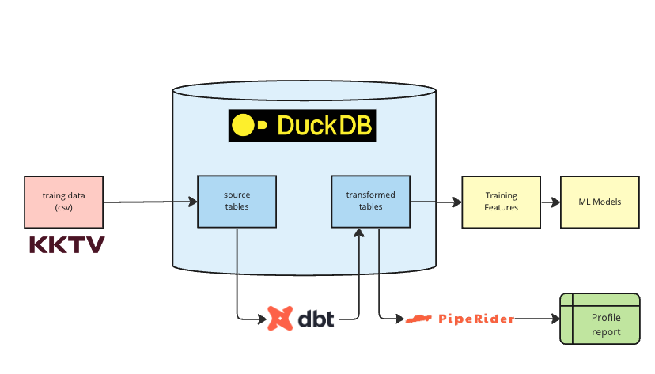

## 介紹



這個 project 示範如何用 [duckdb](https://duckdb.org/), [dbt](https://www.getdbt.com/), [piperider](https://github.com/InfuseAI/piperider)，針對 KKTV x NTHU 的資料，做資料清洗 (cleaning) 轉換 (transformation) 跟分析 (analysis)

- **duckdb**: 是一個針對資料分析特化的資料庫。類似 sqlite 是嵌入式(embedded)資料庫，也就是不需要架設伺服器。duckdb 針對資料分析的需求，對儲存跟運算都做到最佳化。
- **dbt**: SQL-based 的 data transformation的工具。透過定義一個 dbt project，我們可以撰寫 SQL scripts，來定義如何做資料的轉換。
- **piperdier**: 資料剖析(data profiling)跟資料品質(data quality)工具。可以整合 database 或是 data warehouse產生出 profiling 報表。對 dbt 也有深度的整合。


## 前置需求

- 需要 python 3.7+
- 此次比賽的資料
- 把此 github repository clone 下來

## 步驟1: 把資料存到 duckdb

1. 下載 dubkcdb CLI。連到 duckdb 下載頁面 https://duckdb.org/docs/installation/ ，選擇 CLI 頁籤並下載。

1. 將比賽的資料放到 `data/` 目錄

1. 產生 duckdb 檔案，並且把資料匯入

    ```
    duckdb nthu_kktv.duckdb < ./data/load.sql 
    ```

1. 觀看產生出的內容

    ```
    duckdb nthu_kktv.duckdb -c 'select * from train_source_events'
    ```

## 步驟2: 用 dbt 來做資料轉換

此 repo 本身就是一個 [dbt project](https://docs.getdbt.com/docs/build/projects)，且已經定義了一些轉換放在 `models/` 目錄，每個 sql scripts 就是一次的資料轉換。這邊所說的 model 並不是 ML 中所說的 model，可以把它視作 database 中的一個 table 或是 view 即可。

以下流程示範如何執行 dbt

1. 安裝 dbt，以及 [duckdb adapter](https://github.com/jwills/dbt-duckdb)

   ```shell
   pip install dbt-core dbt-duckdb
   ```

1. 執行這個 dbt project

    ```shell
    dbt run
    ```

1. 觀察產生出來的檔案

    ```shell
    duckdb nthu_kktv.duckdb -c 'select * from users_filtered'
    ```

1. 可以用 dbt docs 的功能來看這個 project 的資訊

    ```shell
    dbt docs generate
    dbt docs serve
    ```


## 步驟3: 用 piperider 來觀看資料分布

此 repo 本身也是一個 piperider project。主要定義檔案是在 `.piperider/` 的目錄。其中的 `config.yml` 有定義直接整合 dbt project。

以下流程示範如何執行 piperider

1. 安裝 piperider，以及 [duckdb connector](https://docs.piperider.io/cli/supported-data-sources/duckdb-connector)。

    ```shell
    pip install 'piperider[duckdb]'
    ```

2. 執行 piperider

    ```shell
    piperider run
    ```

    執行完後會輸出 html 報表的位置

    *\*Note: 這邊看不到 `stg_events` 這個 model 是因為我們把它定義為一個 `view`，piperider 只會對 `table` 做 profile。*

## 步驟4: 修改轉換內容，並且觀察修改後的資料分布

1. 修改 `models/users.sql`，新增一個 column

   ```sql
   select
   ...
   count(distinct date_trunc('day', event_time)) as active_days,
   ...
   ```

1. 再次執行 dbt 來執行轉換。這邊我們透過 [dbt node selection](https://docs.getdbt.com/reference/node-selection/graph-operators#the-plus-operator) 的功能，可以只跑 `users` 跟他的 children。

   ```shell
   dbt run --select users+
   ```

1. 再次執行 piperdier。這邊我們用 `--dbt-state` 這個參數，可以只跑上一次 dbt 有跑到的 tables。

   ```shell
   piperider run --dbt-state target/
   ```

   *\* Note: `--dbt-state` 此功能只有在 piperider 0.13.0+ 才支援*

## 步驟5: 匯出產生出轉換後的 table

```shell
duckdb ./nthu_kktv.duckdb -csv -c 'select * from users_filtered' > users_filtered.csv  
```


## 結語

此 project 示範了如何透過 duckdb + dbt + piperider 來做的資料前處理工作。這個組合有以下好處

- **duckdb** 是非常有效率的分析資料庫。而且因為不需要伺服器，所以對於在 ML 這種常常在 local 開發跟探索的情境特別適合。
- **dbt** 讓轉換的流程標準化，並且方便 source control，讓整個轉換的流程更容易複製。
- **piperider** 提供快速的方法觀察資料的分布。且透過跟 dbt 整合，讓這個開發流程更為順暢。


接下來可以試試看下面的應用

- 新增一個 `recency` 的feature 在 `users` model 之上。其定義為該使用最後出現時間離 2022/9/17 的秒數，並且觀察其分布。
- 把 `events` 新增 `event_timeslot` 的欄位，根據比賽的定義把 `event_time` 分類在這28個 slots 中。
